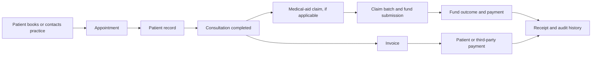
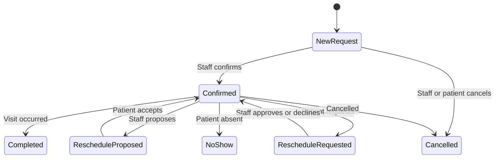
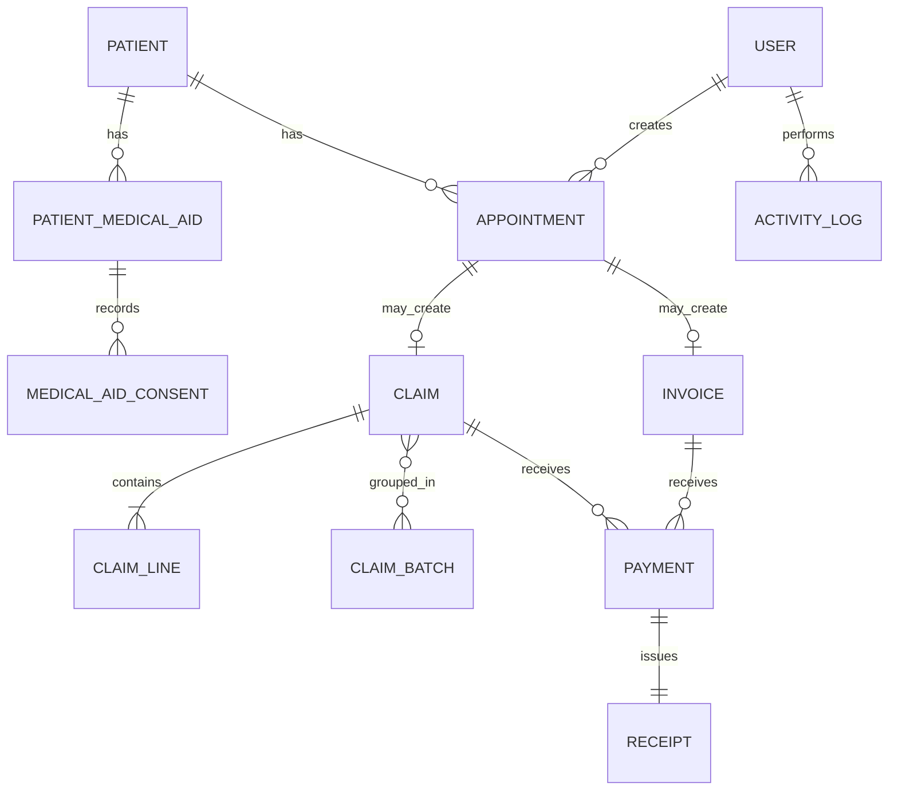

# Mondesa Health Practice Handover Manual

**Audience:** Incoming practice owner or practice manager

**System:** Mondesa Health public website and staff practice-management dashboard

**Prepared from:** Workspace code, database schema, permission rules, server workflows, and a read-only owner-dashboard review
**Companion documents:** [Handover and operations checklist](./MONDESA_HEALTH_HANDOVER_CHECKLIST.md) · [Owner completion runbook](./MONDESA_HEALTH_OWNER_COMPLETION_RUNBOOK.md)

> This manual describes what the application currently does. It is not a promise that every feature is ready for production. Known gaps and go-live blockers are listed in the companion checklist. All examples are intentionally generic and contain no patient-identifying information, passwords, membership numbers, database addresses, or secure links.

## 1. What this system is for

Mondesa Health combines two connected products:

1. A public website where visitors learn about the practice, view services and providers, and book a GP appointment.
2. A protected staff dashboard where authorised team members manage appointments, patient records, medical-aid details and consent, claims, finance, availability, website information, staff access, and the audit trail.

The central operating idea is that information should move forward through one connected record instead of being repeatedly captured in separate tools.

### What it does not currently do

- It does not automatically send WhatsApp messages or email. It prepares text and opens the appropriate external application, or copies the message/link for staff.
- It is not a full electronic clinical-record system. It captures administrative, appointment, funding, claim, and finance information, but there is no consultation-note, prescription, laboratory-result, or clinical-observation module.
- It does not submit claims directly to every medical-aid fund. It prepares claim documents and controlled batches, records how they were submitted, and tracks the outcome.
- It does not process card payments. Staff record a payment after it has happened through cash, card terminal, EFT, medical aid, employer, or another method.
- It does not currently provide multi-factor authentication.

## 2. First access and basic navigation

### 2.1 Signing in

1. Open the staff login page.
2. Enter the staff member's assigned login email and password.
3. Select **Sign in**.
4. A successful login opens the dashboard overview.
5. A failed login shows a generic error. Repeated failures are rate-limited for security.

Staff sessions expire after eight hours. A password change, administrator password reset, role change, permission change, or account-status change invalidates existing sessions.

Newly created staff accounts are marked **Password change due**. The staff member should immediately open **Profile & security**, enter the temporary password as the current password, choose a unique permanent password, and sign in again.

### 2.2 Desktop navigation

The left sidebar is split into three groups:

- **Practice:** Overview, Appointments, Patients.
- **Operations:** Medical aid claims, Claim batches, Finance, Availability.
- **System:** Services & providers, Website content, Medical aid, Settings, Staff users, Activity log.

Only links allowed by the signed-in user's role and permissions are shown. The sidebar can be collapsed to icons. The footer of the sidebar shows the signed-in user, a profile shortcut, and the sign-out button.

The top bar shows the current page, notifications, role, security indicator, and **Open site**, which opens the public website in a new browser tab.

### 2.3 Mobile navigation

1. Select **Open dashboard navigation** in the top bar.
2. Choose the required dashboard page.
3. The drawer closes after navigation.
4. Use the close button, the shaded backdrop, or the Escape key to dismiss it.

The mobile drawer traps keyboard focus while open so keyboard and assistive-technology users do not accidentally move behind it.

### 2.4 Notifications

- The bell refreshes approximately every ten seconds while the dashboard is open.
- The badge shows the number of unread notifications.
- Appointment notifications also appear as a count beside **Appointments**.
- Opening a notification follows its dashboard link and marks it as read.
- **Mark all as read** preserves notifications but removes the unread state.
- **Clear all** deletes notifications for the signed-in user only.

At present, new public bookings generate staff appointment notifications. Notifications are dashboard alerts; they are not SMS, email, or WhatsApp messages.

### 2.5 Signing out

Use the sign-out icon beside the signed-in user. Always sign out on a shared workstation. Closing the browser is not a substitute for signing out.

## 3. Roles and permissions

### 3.1 Default roles

| Role | Intended use | Default access summary |
| --- | --- | --- |
| Owner | Practice owner or accountable system custodian | Every permission, including staff management and ICD-10 import |
| Admin | Senior operational administrator | Almost all operational and configuration access, excluding staff management and ICD-10 import by default |
| Doctor | Treating practitioner | Overview, appointments, patients, claims, consent, claim validation/export, and activity |
| Receptionist | Front desk | Overview, appointments, patients, availability, memberships, and consent |
| Billing | Claims and accounts | Overview, claims, finance, ICD-10 search, batches, submissions, outcomes, and exports |

Role defaults are only starting points. Staff access can be customised using individual permission checkboxes.

### 3.2 Exact default permission matrix

| Permission | Owner | Admin | Doctor | Receptionist | Billing |
| --- | :---: | :---: | :---: | :---: | :---: |
| View dashboard overview | ✓ | ✓ | ✓ | ✓ | ✓ |
| Manage appointments | ✓ | ✓ | ✓ | ✓ | — |
| Manage patients | ✓ | ✓ | ✓ | ✓ | — |
| Manage medical-aid claims | ✓ | ✓ | ✓ | — | ✓ |
| Manage invoices and payments | ✓ | ✓ | — | — | ✓ |
| Manage availability | ✓ | ✓ | — | ✓ | — |
| Manage practice settings | ✓ | ✓ | — | — | — |
| View activity log | ✓ | ✓ | ✓ | — | — |
| Manage staff and permissions | ✓ | — | — | — | — |
| Manage medical-aid settings | ✓ | ✓ | — | — | — |
| Import ICD-10 datasets | ✓ | — | — | — | — |
| Search ICD-10 codes | ✓ | ✓ | ✓ | — | ✓ |
| Manage patient memberships | ✓ | ✓ | — | ✓ | — |
| Manage ICD-10 consent | ✓ | ✓ | ✓ | ✓ | — |
| View claim information | ✓ | ✓ | ✓ | — | ✓ |
| Create and edit claims | ✓ | ✓ | ✓ | — | ✓ |
| Validate and mark claims ready | ✓ | ✓ | ✓ | — | ✓ |
| Submit claims | ✓ | ✓ | — | — | ✓ |
| Record claim outcomes | ✓ | ✓ | — | — | ✓ |
| Manage claim batches | ✓ | ✓ | — | — | ✓ |
| Export claim documents | ✓ | ✓ | ✓ | — | ✓ |

Important access rules:

- Owner access always includes all permissions.
- Only an owner may create or modify another owner account.
- Only an owner may import, activate, or delete an ICD-10 dataset.
- Only an owner may permanently delete an eligible staff account or run **Start from scratch**.
- Sensitive API actions re-check permissions against the database even if a user can see a page or has an old browser session.

## 4. The complete practice workflow

### 4.1 Public online booking

The patient does not create an account.

1. The patient opens the public booking page.
2. They enter their name, Namibian phone number, date of birth, gender, preferred communication method, reason for visit, payment type, and appointment preference.
3. If medical aid is selected, they choose a public fund and may enter a membership number. These details are initially unverified.
4. In **Show live available times** mode, the patient chooses a free time and the appointment is immediately **Confirmed**.
5. In **Accept appointment requests** mode, the patient chooses a preferred date/period and the appointment is created as a **New request** without a final time.
6. The system matches an existing patient by phone number plus date of birth, or creates a new patient record.
7. The booking creates an appointment, an audit entry, a staff notification, and a private appointment-management link valid for 60 days.

Slot availability considers weekly hours, appointment duration, buffer time, lunch settings stored in the database, existing appointments, blocked periods, active reschedule holds, maximum bookings per day, and whether the time has already passed.

### 4.2 Patient secure appointment link

The private link allows a patient to manage only the linked appointment without a dashboard account.

The patient can:

- view the current appointment status and time;
- accept a staff-proposed reschedule;
- request another available date/time with an optional reason; or
- cancel the appointment.

A patient-requested time is held for 48 hours while staff review it. Staff can approve or decline the request. A staff-proposed time is also held for 48 hours until accepted or superseded.

The link becomes unusable if it expires, is revoked, is marked used, or is invalid. Completed, cancelled, and no-show appointments cannot be changed online.

### 4.3 Staff-created appointment

Use this when the booking arrives by phone, walk-in, WhatsApp, or an internal staff request.

1. Open **Appointments** and choose **Add appointment**.
2. Select an existing patient or create a minimal new patient.
3. Record the source.
4. Choose **Schedule a time** or **Walk-in now**.
5. For a scheduled visit, choose the date and an available time.
6. Enter the reason and optional internal note.
7. Save. Staff-created appointments are immediately **Confirmed**.

Walk-ins use the current minute and require a second confirmation because they can overlap an ongoing consultation.

### 4.4 Preparing the patient record

Before a medical-aid claim, confirm:

- full legal name;
- date of birth;
- gender where relevant to ICD-10 validation;
- contact details and preferred communication;
- current fund and membership number;
- principal member, relationship, and dependant code;
- benefit option and pre-authorisation when applicable; and
- a current, granted ICD-10 disclosure consent.

Historical memberships remain stored. Marking one membership current automatically marks other memberships for that patient historical.

### 4.5 Completing the consultation administratively

After the visit, open the appointment and choose **Mark completed**. Only completed appointments are offered as claim starting points. A no-show should be marked **No-show** rather than completed. Do not create a claim from a no-show.

### 4.6 Preparing a medical-aid claim

1. Open **Medical aid claims** and choose **Create claim**.
2. Start from a completed appointment or from a patient record.
3. Select the current membership and fund.
4. Confirm direct medical aid versus patient reimbursement, provider, and service-date range.
5. Add one or more claim lines.
6. Select a configured procedure item or enter a verified manual procedure code and description.
7. Enter quantity, unit amount, modifier, NAPPI code, and pre-authorisation where required.
8. Search the active ICD-10 dataset and add exactly one valid primary diagnosis per line, plus no more than nine secondary diagnoses.
9. Add protected supporting attachments where required.
10. Save the draft, then select **Validate**.
11. Correct every validation error. Warnings require review but do not by themselves prevent readiness.
12. A successful validation changes the claim to **Ready to submit** and freezes patient, membership, practice, provider, and consent snapshots for historical accuracy.

Validation checks include membership data, granted consent, active fund, practice and claim-contact configuration, provider, service dates, procedures, amounts, diagnosis validity, NAPPI/pre-authorisation requirements, age/gender warnings, totals, and possible duplicates.

### 4.7 Creating and submitting a claim batch

1. Open **Claim batches**.
2. Choose **Create batch**.
3. Select one medical-aid fund, one submission method, and first submission versus resubmission.
4. Select only eligible **Ready to submit** claims.
5. Create the batch. Included claims become **Batched**.
6. Download and review the cover sheet, PDF manifest, and/or CSV manifest.
7. Submit through the selected external method.
8. Choose **Mark submitted**, enter the external submission reference and date, and confirm.
9. When the fund confirms receipt, choose **Mark acknowledged**.
10. When batch administration is finished, choose **Complete batch**.

Marking a batch submitted locks the included claims. The dashboard records submission; it does not itself transmit the batch to a fund portal or email address.

### 4.8 Recording a claim outcome

From the individual claim history:

- mark a submitted claim acknowledged;
- record partial medical-aid payment;
- mark it paid;
- mark it rejected with a description and optional rejection code; or
- create a resubmission from a rejected claim.

A recorded medical-aid payment creates a payment and receipt record. If the claim is linked to an appointment invoice, the medical-aid amount also updates that invoice. The system checks for a narrow duplicate based on claim, payer, amount, and generated note, but staff must still reconcile against the actual remittance.

### 4.9 Creating an invoice and recording payment

1. Open **Finance** and select **Create invoice**.
2. Choose a patient.
3. Choose whether the patient or medical aid is fully responsible.
4. Enter the description and amount.
5. Save the single-line draft invoice.
6. Preview the PDF and verify identity, address, totals, and responsibility before sharing.
7. Use **Share** to prepare a secure link and editable message, then open WhatsApp/email or copy the content.
8. After money is actually received, choose **Record payment**.
9. Select payer, payment method, amount, and optional note.
10. Save. The system creates a payment record and receipt number and updates the invoice to **Partially paid** or **Paid**.

Never treat the payment screen as a card terminal or bank confirmation. It records a transaction that staff have independently verified.

## 5. Screen-by-screen dashboard guide

## 5.1 Overview

**Purpose:** A daily snapshot for the practice manager.

| Item | What it does | Record affected | Permission | Expected result / warning |
| --- | --- | --- | --- | --- |
| Today's appointments | Counts appointments whose start time is today | Appointment, read-only | View overview | Use as a quick workload indicator |
| Pending requests | Counts new, pending, and reschedule work | Appointment, read-only | View overview | Review Appointments for details |
| Claims needing attention | Counts active information, rejection, and resubmission problem states | Claim, read-only | View overview | Includes the canonical `NEEDS_INFORMATION` state |
| Outstanding balances | Invoice total less patient and medical-aid payments | Invoice, read-only | View overview | Excludes void invoices; only unpaid drafts can be voided with a reason |
| Received today | Sums payments dated today | Payment, read-only | View overview | Based on recorded payments, not bank settlement |
| Today's agenda | Lists time, patient, phone, reason, and status | Appointment, read-only | View overview | Contains sensitive information; avoid displaying publicly |
| Practice pulse | Calculates the next genuinely available appointment from working hours, notice/advance limits, breaks, blocks, bookings, buffers, holds, and daily limits | None | View overview | “No slot available” means none was found inside the configured advance window |
| Quick actions | Opens Appointments, Patients, Finance, or Claims | None until the destination action is completed | Destination permission also applies | The link does not itself create a record |

**Use case:** The manager opens the dashboard at the start of the day, checks the agenda and pending work, then follows the relevant module.

## 5.2 Appointments

**Purpose:** Manage all public and staff-created bookings.

| Control | Function | Record affected | Expected result / warning |
| --- | --- | --- | --- |
| Search | Finds patient name, phone, reference, or reason | Read-only | Search results are limited to the loaded appointment set, currently up to 250 |
| Quick filters | All, Today, Upcoming, Requests, Past | Read-only | Requests covers new and reschedule states |
| Status/source/date filters | Narrows by workflow state, booking source, or date range | Read-only | Current unsupported statuses may appear only under All |
| Sort | Next/latest appointment, patient, or status | Read-only | Sorting occurs in the browser |
| Add appointment | Creates scheduled or immediate staff booking | Patient optionally; Appointment; Activity log | New minimal patients may need completion before claims |
| Confirm | Moves a new/pending request to Confirmed | Appointment; Activity log | Only valid from new or pending confirmation |
| Propose reschedule | Holds a new time for 48 hours | Appointment; Appointment change request; Activity log | Original and proposed time remain protected until resolved |
| Approve/decline request | Resolves a patient-requested change | Appointment; Change request; Activity log | Approval changes the appointment time; decline keeps original time |
| Complete | Marks consultation complete | Appointment; Activity log | Enables claim creation from that appointment |
| No-show | Marks patient absent | Appointment; Activity log | Terminal state for online management |
| Cancel | Marks cancelled after confirmation dialog | Appointment; pending changes; Activity log | Data is retained; slot becomes available |
| Prepare message | Builds confirmation/cancellation/reschedule text and secure link | May create/refresh secure sharing data | Staff must review and send externally |

**Permission:** Manage appointments.

**Use case:** Reception receives a phone call, creates an appointment for an existing patient, then copies the prepared confirmation into WhatsApp.

## 5.3 Patients

**Purpose:** Maintain the active administrative patient register.

| Control | Function | Record affected | Expected result / warning |
| --- | --- | --- | --- |
| Search | Finds name, international/local phone, email, or patient number | Read-only | No partial record is changed by searching |
| Sort | Name, creation date, or visit count | Read-only | Visit count is based on linked appointments |
| Add patient | Creates an active patient record | Patient; Activity log | A unique generated patient number is assigned |
| Edit | Updates core contact, date of birth, gender, communication, and basic funding | Patient; current membership; Activity log | Basic form does not capture full claim-ready membership detail |
| Medical-aid icon | Opens the detailed benefits profile | Read-only until saved | Use this before claim preparation |
| Archive | Removes patient from active lists but preserves history | Patient `archivedAt`; Activity log | Linked appointments, claims, invoices, payments, and audit history remain |

**Permission:** Manage patients. Detailed funding actions additionally require membership/consent permissions.

**Use case:** Reception completes the date of birth and communication preference for a patient created during a phone booking.

## 5.4 Patient medical-aid profile

**Purpose:** Maintain claim-ready funding information and ICD-10 disclosure consent.

| Control | Function | Record affected | Expected result / warning |
| --- | --- | --- | --- |
| Add/edit membership | Captures fund, membership number, plan, principal, relationship, dependant, dates, pre-authorisation, billing flags, and notes | PatientMedicalAid; Activity log | Membership number is masked in summaries |
| Mark current | Makes a historical membership current | PatientMedicalAid records | Other current memberships for the patient become historical |
| Record consent | Appends Granted, Declined, or Withdrawn decision | MedicalAidConsent; Activity log | History is append-only; the newest decision controls validation |
| Upload card/consent | Stores PDF/JPG/PNG in protected database attachment storage | ClaimAttachment; Activity log | Requires authenticated access; maximum server rules apply |

**Use case:** A receptionist verifies the patient’s new fund card, records the membership, and a doctor or authorised staff member captures consent before diagnosis data is used in a claim.

## 5.5 Medical aid claims

**Purpose:** Find, create, and monitor claims.

| Control | Function | Record affected | Expected result / warning |
| --- | --- | --- | --- |
| Summary cards | Counts draft, needs-information, ready, and submitted value | Claim, read-only | Use individual claims for detailed accuracy |
| Search/status filter | Finds claim, patient, fund, or masked membership | Read-only | Does not expose full membership number in the table |
| Create claim | Prefills from completed appointment or patient | Claim; Activity log | Starts as Needs information; missing data is not invented |
| Claim number link | Opens editor | Read-only until action | Requires view-claim permission |
| Claim batches | Opens batch workspace | None | Requires batch permission |

**Use case:** Billing filters to **Needs information**, opens each claim, and resolves missing membership, consent, procedure, or diagnosis data.

## 5.6 Claim editor

**Purpose:** Build, validate, document, and follow one claim.

| Section/control | Function | Record affected | Expected result / warning |
| --- | --- | --- | --- |
| Membership/fund/type/provider/dates | Sets claim header | Claim | Selecting a membership fills its fund |
| Claim lines | Adds procedures, quantities, rates, and supporting codes | ClaimLine | Server recalculates totals |
| ICD-10 search | Searches only the active imported dataset | ClaimLineIcd10Code | Invalid clinical/primary codes are disabled |
| Add/remove line | Changes draft line set | Client draft, then ClaimLine on save | Save replaces stored lines transactionally |
| Attachments | Uploads/downloads protected supporting documents | ClaimAttachment | PDF, JPG, and PNG only |
| Save draft | Persists editable claim and returns it to Draft | Claim, lines, codes, Activity log | Submitted/locked claims cannot be edited |
| Validate | Saves, checks rules, and marks ready or needs information | Claim snapshots; Activity log | Errors block readiness; warnings require review |
| Preview statement | Generates a claim PDF and logs export | Activity log | Review before external use |
| Record outcome | Appends fund result and may record payment | Claim, ClaimStatusEvent, Payment, Receipt, Invoice, Activity log | Requires claim-outcome permission |
| Create resubmission | Copies rejected claim to a new editable claim | Original Claim, new Claim and lines, status history | Original becomes Resubmitted |

**Use case:** Billing selects a verified consultation procedure, adds one valid primary ICD-10 code, validates the claim, and sends it to the ready queue.

## 5.7 Claim batches

**Purpose:** Group validated claims for one fund and one submission type.

| Control | Function | Record affected | Expected result / warning |
| --- | --- | --- | --- |
| Create batch | Groups eligible ready claims | ClaimBatch, ClaimBatchItem, Claim statuses, Activity log | A claim cannot be in another active batch |
| Cover sheet | Generates fund cover PDF | Activity log may record export | Review fund details first |
| Manifest PDF/CSV | Produces submission inventory | Read/export | Treat exports as confidential |
| Mark submitted | Records external reference/date and locks claims | Batch, claims, status events, Activity log | Does not send files externally |
| Mark acknowledged | Records fund receipt | Batch, claims, status events | Only from Submitted |
| Complete batch | Finishes batch administration | ClaimBatch, Activity log | Only from Acknowledged |

**Use case:** Billing groups all ready first-submission claims for one fund, downloads the manifest, submits through the fund portal, and records the portal reference.

## 5.8 Finance

**Purpose:** Create simple invoices, record payments, and share invoice PDFs.

| Control | Function | Record affected | Expected result / warning |
| --- | --- | --- | --- |
| Summary cards | Totals invoiced, payments, patient outstanding, and fund outstanding | Invoice, read-only | Based only on recorded ledger values |
| Create invoice | Creates a single-line draft for patient or full fund responsibility | Invoice, InvoiceLine, Activity log | No split responsibility in current UI |
| Record payment | Captures payer, method, amount, and note | Payment, Receipt, Invoice, Activity log | Confirm payment externally; paid/void invoices and amounts above the outstanding balance are rejected |
| View | Opens a generated invoice PDF in a dashboard frame | Read-only | Identity, contact, signatory, registration, and currency values come from Practice settings; verify saved values before issue |
| PDF | Downloads invoice | Read-only | Treat as sensitive patient information |
| Share | Creates an expiring secure document link and editable message | GeneratedDocument; Activity log | Staff chooses WhatsApp/email/copy; no automatic sending |
| Receipt | Views or downloads the receipt issued with a recorded payment | Receipt, read-only | Treat as sensitive financial and patient information |
| Share receipt | Prepares an expiring receipt link and editable message | GeneratedDocument; Activity log | Opening WhatsApp/email does not assert delivery |
| Void | Voids an unpaid draft invoice after a reason is entered | Invoice, GeneratedDocument, Activity log | Paid or part-paid invoices cannot be voided; active shares are revoked |

**Use case:** After a private consultation, billing creates an invoice, confirms an EFT in the bank, records it, and shares the invoice link with the patient.

## 5.9 Availability

**Purpose:** Control what public and staff booking can offer.

| Control | Function | Record affected | Expected result / warning |
| --- | --- | --- | --- |
| Public booking mode | Switches live times versus requests | PracticeSetting; Activity log | Immediately changes public booking behaviour |
| Day active toggle | Opens/closes a weekday | AvailabilityRule; Activity log | Inactive days have no public or staff slots |
| Opening/closing time | Defines booking window | AvailabilityRule | Closing must be after opening |
| Slot duration | Sets consultation length | AvailabilityRule | Options exposed are 20, 30, 40, 45, or 60 minutes |
| Add blocked time | Removes a period from availability | BlockedTime; Activity log | UI calls reason optional, but current API rejects blank/one-character reasons |
| Remove blocked time | Restores future availability | BlockedTime; Activity log | Does not change existing appointments |

**Use case:** The manager blocks a training afternoon and confirms that the public booking calendar no longer offers those times.

## 5.10 Services & providers

**Purpose:** Control the public service directory.

| Control | Function | Record affected | Expected result / warning |
| --- | --- | --- | --- |
| Add/manage department | Sets public name, URL slug, category, summary, description, status, publication, booking, and order | Department; Activity log | Only General Practice may enable online booking |
| Department order | Controls public sequence | Department | Save order after changing values |
| Add/manage service | Adds a public service under a department | DepartmentService; Activity log | Publication can be disabled without deleting |
| Add/manage provider | Adds biography/contact/hours under a department | Provider; Activity log | Keep unpublished until details are confirmed |
| Delete | Permanently removes eligible directory content | Department/Service/Provider; Activity log | Department deletion cascades to its services/providers; General Practice is protected in UI |

**Use case:** The owner publishes a confirmed physiotherapy department and provider only after contact details and operating hours have been approved.

## 5.11 Website content

**Purpose:** Edit public homepage wording without changing code.

Sections include:

- Hero message, buttons, and trust points.
- About heading, paragraphs, and two values.
- Appointment heading, button, and three explanatory steps.
- Contact heading and button labels.
- Closing call to action.

The editor marks sections complete or needing details, warns about unsaved changes, provides **Preview website**, and publishes changes on save. It changes wording, not practice contact values or directory entries; those are managed in Settings and Services & providers.

**Permission:** Manage practice settings.

**Use case:** The owner updates the homepage introduction, previews the public page, and publishes after proofreading on mobile and desktop.

## 5.12 Medical aid configuration

**Purpose:** Maintain fund rules, procedure items, and ICD-10 reference data.

### Funds

- Search/filter active or disabled funds.
- Add/edit name, code, administrator, claim/support contact, portal, address, submission instructions, method, cover-sheet rule, service-date rule, public visibility, and order.
- Disable referenced funds rather than deleting them.
- **Public** means the fund is offered in public booking; **Active** means it can be used operationally.

### Procedure items

- Add/edit verified code, name, category, description, default amount, NAPPI requirement, pre-authorisation requirement, and active status.
- Do not invent tariff codes or amounts.
- Disable a procedure referenced by historical claims rather than deleting it.

### ICD-10 datasets

- Owner uploads an XLSX workbook under a named version.
- The server validates columns, rows, and duplicates and saves the dataset inactive.
- Owner reviews counts, then types the explicit activation phrase to replace the active dataset.
- Historical claim snapshots are preserved.
- The active or historically referenced dataset cannot be deleted.

**Use case:** An owner imports an authorised replacement workbook, reviews validation counts, activates it, and confirms claim search returns the new version.

## 5.13 Settings

**Purpose:** Store organisation-wide values used across the public site, validation, and documents.

| Tab | Values | Main effect |
| --- | --- | --- |
| Practice | Practice/practitioner names, numbers, phone, WhatsApp, email, address | Dashboard and document identity |
| Documents | Currency, signatory, title, VAT flag | Generated document metadata; current invoice template must still be verified |
| Public site | Tagline, description, location, map, coordinates, hours, contact visibility | Public website |
| Claims | Claim contact, phone, email, postal address, consent wording | Claim validation and documents |
| Medical aids | Compact Active/Public switches | Fund availability and public booking choices |
| Data reset | Owner-only destructive reset | Removes operational data while preserving the services and providers directory |

The editor tracks saved/unsaved/error state and warns when leaving with unsaved changes.

### Data reset warning

**Start from scratch** is intentionally destructive. It requires typing an exact confirmation and accepting a second dialog. It removes operational records, documents, patients, appointments, claims, payments, attachments, and activity entries. It preserves staff accounts, reference datasets, availability rules, and the complete services and providers directory. Departments, services, and provider profiles must be edited or deleted manually from **Services & providers**.

Do not use data reset as routine cleanup. Before any authorised reset, create and verify an encrypted backup, record written approval, confirm the exact target environment, and test restoration separately.

## 5.14 Staff users

**Purpose:** Control who can sign in and what they can do.

| Control | Function | Expected result / warning |
| --- | --- | --- |
| Add staff member | Creates name, immutable login email, temporary password, role, and permissions | Account can sign in immediately and must change password |
| Edit access | Changes role and individual permissions | Existing sessions are revoked |
| Enable/disable | Controls login without deleting history | Existing sessions are revoked; users cannot disable themselves |
| Reset password | Generates administrator-set temporary password | Existing sessions are revoked; transfer it securely and only once |
| Delete | Permanently removes an eligible non-owner account | Blocked if linked to audit, appointment, clinical, claim, payment, import, batch, or attachment history; disable instead |

**Use case:** The owner creates a receptionist account with default front-desk permissions and personally delivers a temporary password through an approved channel.

## 5.15 Profile & security

- Change display name.
- Add or remove an avatar stored with the user record.
- View immutable login email and role.
- Change password by entering the current password and a new compliant password.

Passwords require at least 12 characters including uppercase, lowercase, number, and symbol. Changing a password revokes the current session and returns the user to login.

Accepted avatar formats are PNG, JPEG, WebP, GIF, and AVIF, with a client limit of 2 MB and a server encoded-data limit.

## 5.16 Activity log

**Purpose:** Show the latest 200 auditable actions with date/time, action, summary, and responsible staff member or patient/system.

Examples include login, failed login, appointment creation/status changes, patient changes, claim validation/submission/outcomes, payments, settings changes, exports, imports, and staff-access changes.

The page is read-only. Activity entries are designed as history, but the owner-only data reset removes them. Exported or off-system audit retention is not currently provided.

## 6. Status and transition reference

### 6.1 Appointment statuses

| Status | Meaning | Normal next actions |
| --- | --- | --- |
| New request | Public request lacks final confirmed time | Confirm or cancel |
| Pending confirmation | Awaiting staff confirmation | Confirm or cancel |
| Confirmed | Appointment is scheduled | Complete, no-show, propose reschedule, or cancel |
| Reschedule proposed | Staff proposed a held replacement time | Patient accepts, or staff supersedes/cancels |
| Reschedule requested | Patient requested a held replacement time | Staff approves, declines, proposes another time, or cancels |
| Completed | Consultation happened | Create claim/invoice as appropriate |
| No-show | Patient did not attend | Terminal in current UI |
| Cancelled | Appointment cancelled | Terminal in current UI |
| Review required | Present in current data but not supported by normal filters or server transition map | Treat as an exception requiring technical review |

### 6.2 Claim statuses

| Status | Meaning | Normal next action |
| --- | --- | --- |
| Needs information | Initial or failed validation state | Complete data and save/validate |
| Draft | Editable saved claim | Validate |
| Ready to submit | Validation passed | Add to eligible batch |
| Batched | Included in a prepared batch | Submit batch |
| Submitted | Sent externally and reference recorded | Acknowledge, pay, reject, or require resubmission |
| Acknowledged | Fund confirmed receipt | Pay, partially pay, reject, or require resubmission |
| Partially paid | Some medical-aid payment recorded | Record additional outcome/payment or mark paid |
| Paid | Fund payment outcome complete | Terminal for normal workflow |
| Rejected | Fund rejected claim | Create resubmission where appropriate |
| Resubmission required | Corrected submission is required | Create resubmission |
| Resubmitted | Original claim has a linked replacement | Follow the new claim |
| Cancelled | Claim withdrawn before submission | Terminal; server supports this state but current editor has no cancel control |
| Missing information | Legacy/current data variant counted by some overview logic | Review and normalise through technical remediation |

### 6.3 Batch statuses

`Ready → Submitted → Acknowledged → Completed`

The server also supports cancellation from Draft/Ready, returning claims to Ready to submit, but the current dashboard does not expose a cancel-batch control.

### 6.4 Invoice and payment statuses

- **Draft:** Newly created invoice.
- **Partially paid:** Recorded payments are below total.
- **Paid:** Recorded payments meet or exceed total.
- **Void:** Accounted for in overview calculations, but no current dashboard action creates it.

Each recorded payment has a payer and method and receives a payment reference plus receipt record.

### 6.5 Consent statuses

- **Granted:** Current claim validation can proceed if other requirements pass.
- **Declined:** Diagnosis disclosure validation fails.
- **Withdrawn:** Supersedes earlier granted consent for future validation.
- **Not captured:** No usable consent.

Consent history is append-only; record a new decision rather than editing old consent.

### 6.6 Staff account statuses

- **Enabled:** May sign in, subject to permissions.
- **Disabled:** Cannot sign in; history remains.
- **Password change due:** Administrator issued/reset the password and the user must change it.

## 7. Daily, weekly, and monthly operating rhythm

### Daily opening

1. Sign in using an individual account.
2. Review notifications and pending appointment requests.
3. Compare today's agenda with the actual diary and staff availability.
4. Check blocked time and unexpected gaps.
5. Review claims needing information and outstanding finance work.

### During the day

- Record the true appointment source and status.
- Complete patient demographics before claims.
- Treat membership numbers, diagnosis codes, attachments, and financial documents as confidential.
- Confirm external payment before recording it.
- Review every generated message before sharing.
- Never share a secure link with anyone other than the intended patient/recipient.

### End of day

1. Mark attended appointments completed and absences no-show.
2. Resolve or document unconfirmed/reschedule requests.
3. Match recorded payments to terminal/bank evidence.
4. Review newly created claims for missing information.
5. Sign out of shared devices.

### Weekly

- Review upcoming blocked periods and working hours.
- Review archived/duplicate patient concerns without deleting history.
- Reconcile invoices, payments, receipts, claim outcomes, and remittances.
- Review disabled and password-change-due staff accounts.
- Review activity for unexpected access or configuration changes.
- Confirm scheduled encrypted backups are being created.

### Monthly

- Perform a restore drill to a separate disposable database.
- Review staff permissions against current duties.
- Confirm practice, fund, provider, directory, and public website information.
- Review claim rejection/resubmission patterns.
- Refresh the readiness snapshot and close resolved risks.

Use the [companion checklist](./MONDESA_HEALTH_HANDOVER_CHECKLIST.md) for sign-off boxes and ownership.

## 8. Staff onboarding and offboarding

### Onboarding

1. Owner confirms the staff member's role and minimum required permissions.
2. Create an individual account; never share a generic account.
3. Generate a temporary password and transfer it through an approved private channel.
4. Require immediate password change.
5. Ask the staff member to demonstrate only their assigned workflows.
6. Verify they cannot access unrelated sensitive modules.
7. Record onboarding approval outside the application if required by policy.

### Role change

1. Confirm the new duties in writing.
2. Change role, then review every permission checkbox.
3. Existing sessions are automatically invalidated.
4. Ask the user to sign in and validate the new least-privilege access.

### Offboarding

1. Disable the account immediately when access should end.
2. Do not delete an account that has protected history.
3. Reassign operational work outside the system as needed.
4. Review recent activity and reset any separately shared external credentials.
5. Retain the disabled account to preserve attribution.

## 9. Security, privacy, and data retention

### Minimum operating rules

- Use a unique named account for every staff member.
- Rotate the owner credential before handover because a default credential has been exposed during development/evaluation.
- Never place passwords, database strings, backup keys, or secure links in documentation or ordinary chat.
- Use least privilege and disable departed staff immediately.
- Do not download patient/claim documents to unmanaged devices.
- Lock the workstation when unattended and sign out on shared devices.
- Treat exported PDF/CSV files and screenshots as confidential health information.
- Keep the authentication secret separate from database and backup credentials.

### Retention behaviour in the application

- Archiving a patient preserves linked operational history.
- Membership and consent history is retained.
- Submitted claim details use snapshots so later edits do not rewrite historical submissions.
- Referenced funds, procedures, ICD-10 datasets, and staff users are protected from deletion in key workflows.
- Private attachments are stored as database bytes and therefore included in database backup scope.
- Notification deletion is user-level cleanup, not clinical/audit deletion.
- Data reset is the exceptional destructive path and removes activity history as well as operational data.

The practice must establish its own approved retention, access, disclosure, breach-response, and secure-disposal policy with appropriate Namibian legal and professional guidance.

## 10. Backup and restore operations

### Encrypted backup

The supported logical backup uses the direct database connection, `pg_dump`, OpenSSL AES-256 encryption, and `pg_restore --list` verification.

Requirements:

- PostgreSQL client tools and OpenSSL installed on the backup machine.
- A dedicated backup encryption key of at least 32 characters.
- A restricted directory on encrypted storage outside the repository.
- The encryption key stored separately from backup files.

Run the repository's backup command from the controlled operational environment. A successful run creates an encrypted custom-format dump, restricts file permissions, decrypts it through a verification pipe, and confirms `pg_restore` can read the archive.

### Restore drill

1. Provision a separate disposable database.
2. Confirm it is not the source/live database.
3. Set the restore target and explicit restore confirmation in the controlled environment.
4. Run the restore-test command with the encrypted backup path.
5. The script decrypts and restores with clean/replace behaviour against the disposable target.
6. Record date, backup filename, target identity, result, duration, and operator.
7. Destroy or secure the disposable database after verification.

The restore script refuses a target with the same host/database identity as the source. Nevertheless, the operator must independently verify the target before running it.

### Snapshot utility

The repository also has a database snapshot utility that serialises every public table and writes an encrypted snapshot plus a separate recovery-key file. Because those two files together can recover all data, store them in separate controlled locations. The documented `pg_dump` backup plus restore drill remains the primary operational method.

## 11. Incident response and troubleshooting

### Suspected account compromise

1. Owner disables the affected account or resets its password.
2. This increments the session version and revokes existing sessions.
3. Review the latest activity entries for unexpected actions.
4. Preserve logs and relevant evidence; do not run data reset.
5. Rotate any related external credentials.
6. Follow the practice's breach and notification process.

### Dashboard cannot connect to the database

1. Stop actions that could write to an uncertain environment.
2. Check for duplicated variables within and across `.env` and `.env.local` without printing values.
3. Confirm which file the runtime loads and which database identity it resolves.
4. Confirm pooled connection is used for application runtime and direct connection for migrations/backups.
5. Test connectivity without seeding, migrating, resetting, or changing records.
6. Correct one authoritative environment configuration and restart.

The local workspace was consolidated to one authoritative `.env` on 19 July 2026. Run `pnpm env:check` after any environment change; it rejects duplicate/conflicting files, missing values, unsafe secrets, and mismatched pooled/direct database identities without printing secrets.

### Appointment time unavailable

- Refresh slots; another booking or reschedule hold may have taken the time.
- Check weekly hours, blocked periods, maximum-per-day rules, and existing appointments.
- Do not bypass collision checks by changing the database manually.

### Claim will not validate

- Read every validation message.
- Confirm patient date of birth/gender, active membership, principal/relationship/dependant data, granted consent, claim contact configuration, provider, service dates, procedure requirements, exactly one primary ICD-10 code per line, and totals.
- Confirm an active ICD-10 dataset exists.

### Staff cannot see a module

- Verify account is enabled.
- Review role and explicit permissions.
- Ask the user to sign in again because access changes invalidate old sessions.
- Do not assign Owner merely to solve a missing permission.

### Invoice or claim document is wrong

- Do not share it.
- Compare practice settings with generated output.
- Correct configuration only if the template actually consumes that field.
- Invoice and receipt PDFs now use saved Practice settings. If output is wrong, correct and verify the setting before sharing; do not alter historical financial records to disguise a configuration error.

### Backup fails

- Confirm required tools are installed.
- Confirm direct database connectivity, output directory permissions, key length, and available disk space.
- Do not weaken encryption or place the key beside shared backup copies.
- A created file is not considered usable until a restore drill succeeds.

## 12. Current-state snapshot and readiness note

The read-only planning snapshot found the following demonstration/transition data:

| Record type | Count |
| --- | ---: |
| Staff accounts | 3 |
| Patient records | 10 |
| Appointments | 14 |
| Claims | 9 |
| Claim batches | 0 |
| Invoices | 3 |
| Payments | 1 |
| Departments | 7 |
| Providers | 0 |
| Medical-aid funds | 7 |
| Procedure items | 0 |

All existing claims were in information-deficient states at the time of review. Claim contacts were blank, and no procedure items or batches existed. Counts are time-sensitive and must be refreshed at formal handover.

After remediation on 19 July 2026, the unit suite passed 29 of 29 tests and lint completed with no errors or warnings. The production build passed and public/runtime route smoke checks succeeded; authenticated workflow rehearsal must still be recorded in the checklist. See the [prioritised readiness register](./MONDESA_HEALTH_HANDOVER_CHECKLIST.md#15-prioritised-readiness-register).

### Remediation release now in operation

- One authoritative environment file is used; a new authentication secret revoked prior sessions. The owner password itself still requires confidential owner-operated rotation.
- Slot results enforce minimum notice and maximum advance settings, and Overview calculates the next available appointment.
- `NEEDS_INFORMATION` is included in claim attention; the legacy claim status was normalised without changing claim content.
- `REVIEW_REQUIRED` appointments appear in filters and can be resolved according to whether their appointment time is future or past/current.
- Blocked-time reason is optional in both the form and API.
- Claims and Medical aid show setup warnings when claim contacts, active ICD-10 data, or procedures are missing.
- An unpaid draft invoice can be voided with an audited reason. Paid/void invoices reject payments, and overpayments are rejected inside a serializable transaction.
- Payments produce downloadable/shareable receipt PDFs. WhatsApp and email remain editable external handoffs and never assert delivery.
- Confirmed appointments inside the configured reminder window appear in a staff preparation queue. Staff must explicitly mark a prepared reminder Sent or Dismissed; the application does not send it automatically.
- Activity has 50-row server pagination, filters, search, and a permission-protected 5,000-row CSV export without raw before/after JSON.
- Settings shows protected attachment count and bytes. Uploads retain the 10 MB per-file rule and also enforce the aggregate `ATTACHMENT_STORAGE_LIMIT_MB` quota.

## 13. Technical appendix

### Architecture

- **Next.js App Router:** Public pages, dashboard pages, and API routes.
- **React Server Components:** Load dashboard data on the server.
- **Client components:** Interactive filters, forms, modals, notifications, and editors.
- **Prisma:** Typed data access and transactions.
- **Neon PostgreSQL:** Relational operational database.
- **Zod:** Validates API input.
- **JWT session cookie:** Signed, HTTP-only staff session with eight-hour expiry and database-backed revocation.
- **bcrypt:** Password hashing.
- **React PDF:** Server-generated invoice, receipt, claim, cover-sheet, and manifest documents.
- **ExcelJS:** ICD-10 workbook processing and CSV/XLSX-related data work.
- **Tailwind/custom CSS:** Responsive visual system.

### Main data relationships

### Environment-variable responsibilities

| Variable type | Purpose | Rule |
| --- | --- | --- |
| Pooled database connection | Application runtime | Use the approved pooled Neon endpoint |
| Direct database connection | Prisma operations and backups | Use direct/non-pooled endpoint |
| Authentication secret | Signs staff sessions | At least 32 random characters in production; never reuse another secret |
| Public application URL | Builds canonical secure share URLs | Must match deployed HTTPS origin |
| Backup encryption key | Encrypts logical backups | Separate random key, stored away from backups |
| Backup directory | Encrypted backup destination | Outside repository on restricted encrypted storage |
| Restore database connection | Disposable restore target | Must never be the live/source database |
| Attachment storage limit | Aggregate protected database-storage quota in MB | Defaults to 1,024 MB; retain the separate 10 MB per-file rule |
| Seed owner values | Initial setup only | Remove from routine operations and rotate any exposed default credential |

Do not define the same variable multiple times or maintain conflicting `.env` and `.env.local` values. Next.js and command-line tooling may apply different precedence rules.

### Authentication and authorisation

- Successful login creates a signed session cookie containing user id, session version, role, and permissions.
- Each request reloads the user from the database and rejects disabled users or stale session versions.
- Dashboard route middleware provides an initial permission gate.
- Sensitive pages and API handlers perform additional server/database permission checks.
- Login throttling uses HMAC-derived account/network keys and does not log submitted passwords, raw addresses, or attempted email addresses.

### Attachments and documents

- Claim, membership-card, and consent attachments are stored privately in database binary fields.
- Download routes require appropriate staff permissions.
- Invoice sharing creates an expiring document token rather than exposing the database record id as public access.
- Appointment-management tokens are stored as hashes; only the patient-facing token is presented to the recipient.

## 14. Traceability table

| Dashboard route | Manual section | Primary checklist responsibility |
| --- | --- | --- |
| `/dashboard` | [5.1 Overview](#51-overview) | Daily opening and end-of-day review |
| `/dashboard/appointments` | [5.2 Appointments](#52-appointments) | Pre-opening diary and daily status closure |
| `/dashboard/patients` | [5.3 Patients](#53-patients) | Patient-data quality and privacy |
| `/dashboard/patients/[id]/medical-aid` | [5.4 Patient medical-aid profile](#54-patient-medical-aid-profile) | Membership and consent verification |
| `/dashboard/claims` | [5.5 Medical aid claims](#55-medical-aid-claims) | Claims work queue |
| `/dashboard/claims/[id]` | [5.6 Claim editor](#56-claim-editor) | Claim validation and outcome controls |
| `/dashboard/claim-batches` | [5.7 Claim batches](#57-claim-batches) | Submission reconciliation |
| `/dashboard/finance` | [5.8 Finance](#58-finance) | Payment reconciliation and document review |
| `/dashboard/availability` | [5.9 Availability](#59-availability) | Weekly schedule review |
| `/dashboard/services` | [5.10 Services & providers](#510-services--providers) | Monthly public-directory review |
| `/dashboard/content` | [5.11 Website content](#511-website-content) | Monthly public-content review |
| `/dashboard/medical-aid` | [5.12 Medical aid configuration](#512-medical-aid-configuration) | Fund/procedure/dataset governance |
| `/dashboard/settings` | [5.13 Settings](#513-settings) | Go-live configuration and owner controls |
| `/dashboard/users` | [5.14 Staff users](#514-staff-users) | Staff onboarding/offboarding and monthly access review |
| `/dashboard/profile` | [5.15 Profile & security](#515-profile--security) | First-day password change |
| `/dashboard/activity` | [5.16 Activity log](#516-activity-log) | Weekly security and change review |

## 15. Handover acceptance

The practice should not accept operational handover solely because the dashboard opens. Acceptance requires:

1. One authoritative environment configuration and confirmed target database.
2. Rotated owner credentials and individual enabled staff accounts.
3. Confirmed practice, claim, public-site, document, and fund configuration.
4. Verified invoice and claim document output.
5. A successful encrypted backup and separate restore drill.
6. A sanitised rehearsal covering booking, appointment, patient completion, consent, claim validation, batch submission recording, invoice, payment, and audit review.
7. Named owners for daily operations, access administration, claims, finance reconciliation, backup monitoring, and incident response.
8. Signed completion of the [handover checklist](./MONDESA_HEALTH_HANDOVER_CHECKLIST.md).
